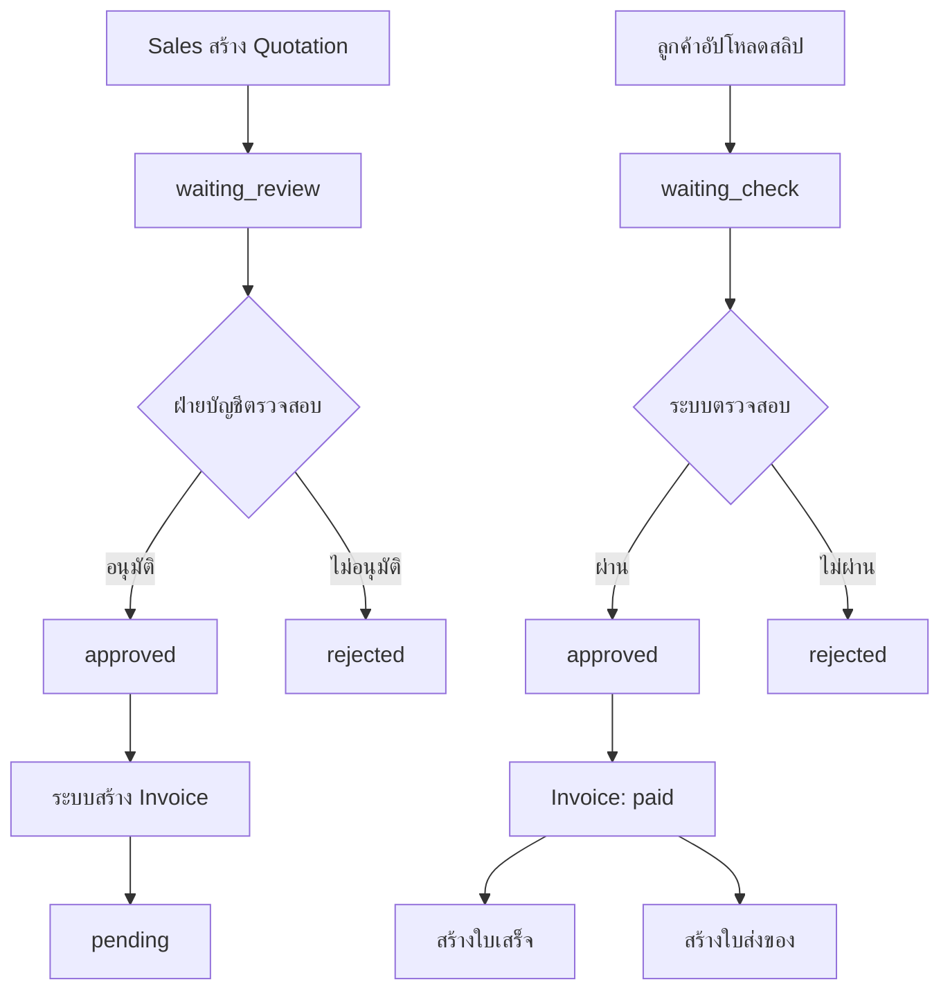

# 🧾 แนวทางการพัฒนาระบบใบเสนอราคา + ใบแจ้งหนี้

> อิงตาม FlowAccount เพื่อความเข้าใจง่ายและตรงตามมาตรฐานธุรกิจ

## 📋 สารบัญ

1. [โครงสร้าง Entity & Relationship (ERD)](#-โครงสร้าง-entity--relationship-erd)
2. [Logic & Flow](#-logic--flow-ตรรกะและลำดับการทำงานฝั่ง-backend-laravel)
3. [แนะนำการจัดวางโฟลเดอร์](#-แนะนำการจัดวางโฟลเดอร์-project-structure)
4. [ตัวอย่าง Status ที่ควรใช้](#-ตัวอย่าง-status-ที่ควรใช้)
5. [ระบบตรวจสอบสลิปอัตโนมัติ](#-ระบบช่วยตรวจสอบสลิป-auto-verify-payment-slip)

---

## ✅ โครงสร้าง Entity & Relationship (ERD)

ระบบนี้ประกอบด้วยเอนทิตีหลักสำหรับจัดการใบเสนอราคา ใบแจ้งหนี้ และเอกสารที่เกี่ยวข้อง

### 🏢 เอนทิตีหลัก

#### 1. **Customer** - ลูกค้า

ผู้ที่เราจะออกใบเสนอราคา/ใบแจ้งหนี้ให้

#### 2. **Quotation** - ใบเสนอราคา

ใบเสนอราคาที่ออกโดยฝ่ายขายให้ลูกค้า

**Fields:**

-   `id` (UUID) - รหัสใบเสนอราคา
-   `customer_id` (UUID) - อ้างอิงถึง Customer
-   `payment_type` (enum) - ประเภทการชำระ: `"full"` ชำระเต็ม หรือ `"deposit"` มีวางมัดจำ
-   `description` (text) - รายละเอียดใบเสนอราคา
-   `file_paths` (JSON) - เอกสารหรือไฟล์แนบ
-   `status` (enum) - สถานะ: `"waiting_review"`, `"approved"`, `"rejected"`
-   `timestamps` - เวลาที่บันทึก/แก้ไขข้อมูล

#### 3. **Invoice** - ใบแจ้งหนี้/ใบกำกับภาษี

ออกจากใบเสนอราคาที่ผ่านการอนุมัติ

**Fields:**

-   `id` (UUID) - รหัสใบแจ้งหนี้
-   `quotation_id` (UUID) - อ้างอิง Quotation ต้นทาง
-   `amount` (decimal) - ยอดเงินตามใบแจ้งหนี้
-   `type` (enum) - ประเภท: `"full"` ยอดเต็ม, `"deposit"` มัดจำ, `"final"` ส่วนที่เหลือ
-   `status` (enum) - สถานะ: `"pending"`, `"paid"`, `"canceled"`
-   `timestamps`

#### 4. **PaymentSlip** - สลิปการชำระเงิน

สลิปที่ลูกค้าอัปโหลดเป็นหลักฐานการโอน

**Fields:**

-   `id` (UUID) - รหัสสลิป
-   `invoice_id` (UUID) - อ้างอิงถึง Invoice ที่ชำระ
-   `file_path` (string) - ที่อยู่ไฟล์ภาพสลิป
-   `paid_amount` (decimal) - จำนวนเงินที่ชำระตามสลิป
-   `status` (enum) - สถานะ: `"waiting_check"`, `"approved"`, `"rejected"`
-   `timestamps`

#### 5. **Receipt** - ใบเสร็จรับเงิน

ออกให้เมื่อมีการชำระเงินตามใบแจ้งหนี้เรียบร้อย

**Fields:**

-   `id` (UUID) - รหัสใบเสร็จ
-   `invoice_id` (UUID) - ใบแจ้งหนี้ที่ชำระครบ
-   `receipt_no` (string) - เลขที่ใบเสร็จ
-   `issued_at` (date) - วันที่ออกใบเสร็จ
-   `timestamps`

#### 6. **DeliveryNote** - ใบส่งของ

หลักฐานการส่งมอบสินค้า ออกเมื่อปิดการขาย (หลังชำระเงินครบ)

**Fields:**

-   `id` (UUID) - รหัสใบส่งของ
-   `invoice_id` (UUID) - ใบแจ้งหนี้ที่เกี่ยวข้อง
-   `delivery_no` (string) - เลขที่ใบส่งของ
-   `delivery_date` (date) - วันที่ส่งของ
-   `timestamps`

### 🔗 ความสัมพันธ์ระหว่างเอนทิตี

| ความสัมพันธ์               | รายละเอียด                                       |
| -------------------------- | ------------------------------------------------ |
| **Customer → Quotation**   | ลูกค้า 1 ราย มีหลายใบเสนอราคา (one-to-many)      |
| **Quotation → Invoice**    | ใบเสนอราคา 1 ใบ สร้างใบแจ้งหนี้ได้อย่างน้อย 1 ใบ |
| **Invoice → PaymentSlip**  | ใบแจ้งหนี้ 1 ใบ มีหลายสลิป (one-to-many)         |
| **Invoice → Receipt**      | ใบแจ้งหนี้ 1 ใบ มีใบเสร็จ 1 ใบ (one-to-one)      |
| **Invoice → DeliveryNote** | ใบแจ้งหนี้ 1 ใบ มีใบส่งของ 1 ใบ (one-to-one)     |

#### 💡 หมายเหตุการชำระเงิน

-   **การชำระเต็ม (`full`)**: สร้างใบแจ้งหนี้ 1 ใบประเภท `full`
-   **การชำระมัดจำ (`deposit`)**: สร้างใบแจ้งหนี้ 2 ใบ
    -   ใบแรก: ประเภท `deposit` (เงินมัดจำ)
    -   ใบสอง: ประเภท `final` (ยอดส่วนที่เหลือ)

### 📊 ER Diagram (Mermaid)

```mermaid
erDiagram
    Customer ||--o{ Quotation : has
    Quotation ||--o{ Invoice : has
    Invoice ||--o{ PaymentSlip : has
    Invoice ||--|| Receipt : has
    Invoice ||--|| DeliveryNote : has

    Customer {
        UUID id
        string name
        string email
        string phone
        timestamps
    }

    Quotation {
        UUID id
        UUID customer_id
        enum payment_type
        text description
        json file_paths
        enum status
        timestamps
    }

    Invoice {
        UUID id
        UUID quotation_id
        decimal amount
        enum type
        enum status
        timestamps
    }

    PaymentSlip {
        UUID id
        UUID invoice_id
        string file_path
        decimal paid_amount
        enum status
        timestamps
    }

    Receipt {
        UUID id
        UUID invoice_id
        string receipt_no
        date issued_at
        timestamps
    }

    DeliveryNote {
        UUID id
        UUID invoice_id
        string delivery_no
        date delivery_date
        timestamps
    }
```

---

## 🧠 Logic & Flow (ตรรกะและลำดับการทำงานฝั่ง Backend Laravel)

### 🔄 ขั้นตอนการทำงานหลัก

| ขั้นตอน                  | ผู้ดำเนินการ        | Controller                              | Service                                                     | รายละเอียด                                                                                                                                  |
| ------------------------ | ------------------- | --------------------------------------- | ----------------------------------------------------------- | ------------------------------------------------------------------------------------------------------------------------------------------- |
| **1. สร้าง Quotation**   | Sales (ฝ่ายขาย)     | `QuotationController@store`             | `QuotationService::create`                                  | สร้างและบันทึกใบเสนอราคาใหม่ในระบบ โดยบันทึกข้อมูลรายละเอียด, ลูกค้า, ประเภทการชำระ และสามารถแนบไฟล์ประกอบได้                               |
| **2. ตรวจสอบ + อนุมัติ** | Account (ฝ่ายบัญชี) | `QuotationController@review`            | `QuotationService::approve` หรือ `QuotationService::reject` | ฝ่ายบัญชีตรวจสอบความถูกต้อง จากนั้นปรับสถานะเป็น `approved` หรือ `rejected` พร้อมบันทึกเหตุผล                                               |
| **3. ออก Invoice**       | ระบบ                | `InvoiceController@createFromQuotation` | `InvoiceService::generate`                                  | เมื่อใบเสนอราคาได้รับการอนุมัติ ระบบสร้างใบแจ้งหนี้ตามประเภทการชำระ:<br>• `full`: 1 ใบเต็มจำนวน<br>• `deposit`: 2 ใบ (มัดจำ + ส่วนที่เหลือ) |
| **4. อัปโหลดสลิป**       | Sales (ฝ่ายขาย)     | `PaymentSlipController@store`           | `PaymentSlipService::verify`                                | ลูกค้าอัปโหลดสลิปการโอนเงิน ระบบรับไฟล์และเริ่มกระบวนการตรวจสอบ (สถานะ `waiting_check`)                                                     |
| **5. ตรวจสอบสลิป**       | Account (ฝ่ายบัญชี) | -                                       | `PaymentSlipService::verify`                                | ใช้ OCR และ QR Code ตรวจสอบความถูกต้อง เปรียบเทียบกับข้อมูลใบแจ้งหนี้                                                                       |
| **6. ออกใบเสร็จ**        | ระบบ                | `ReceiptController@create`              | `ReceiptService::generate`                                  | เมื่อยืนยันการชำระเงิน สร้างใบเสร็จรับเงินโดยอัตโนมัติ                                                                                      |
| **7. ออกใบส่งของ**       | ระบบ                | `DeliveryController@create`             | `DeliveryService::generate`                                 | หลังชำระเงินครบ สร้างใบส่งของเพื่อส่งมอบสินค้า/บริการ                                                                                       |

### 🔍 รายละเอียดแต่ละขั้นตอน

#### 1️⃣ Sales สร้าง Quotation

-   **หน้าที่**: ฝ่ายขายออกใบเสนอราคาให้ลูกค้า
-   **การทำงาน**:
    -   บันทึกข้อมูลรายละเอียดสินค้า/บริการ
    -   เลือกประเภทการชำระ (`full` หรือ `deposit`)
    -   แนบไฟล์เอกสารประกอบ (PDF, รูปภาพ)
    -   สถานะเริ่มต้น: `waiting_review`

#### 2️⃣ Account ตรวจสอบ + อนุมัติ

-   **หน้าที่**: ฝ่ายบัญชีตรวจสอบและอนุมัติใบเสนอราคา
-   **การทำงาน**:
    -   ตรวจสอบความถูกต้องของราคา เงื่อนไข และไฟล์แนบ
    -   อนุมัติ: เปลี่ยนสถานะเป็น `approved`
    -   ปฏิเสธ: เปลี่ยนสถานะเป็น `rejected` พร้อมระบุเหตุผล

#### 3️⃣ ออก Invoice จาก Quotation

-   **หน้าที่**: ระบบสร้างใบแจ้งหนี้อัตโนมัติ
-   **การทำงาน**:
    -   **กรณี `payment_type = "full"`**: สร้าง 1 ใบแจ้งหนี้เต็มจำนวน
    -   **กรณี `payment_type = "deposit"`**: สร้าง 2 ใบแจ้งหนี้
        -   ใบที่ 1: ประเภท `deposit` (เงินมัดจำ)
        -   ใบที่ 2: ประเภท `final` (ยอดส่วนที่เหลือ)
    -   สถานะเริ่มต้น: `pending`

#### 6️⃣ ออกใบเสร็จรับเงิน

-   **หน้าที่**: สร้างใบเสร็จเมื่อชำระเงินสำเร็จ
-   **การทำงาน**:
    -   ตรวจสอบ `invoice.status = paid`
    -   สร้างใบเสร็จพร้อมเลขที่และวันที่
    -   ส่งมอบใบเสร็จให้ลูกค้า

#### 7️⃣ ออกใบส่งของ/ปิดการขาย

-   **หน้าที่**: ส่งมอบสินค้าและปิดงานขาย
-   **การทำงาน**:
    -   ตรวจสอบการชำระเงินครบทุกงวด
    -   สร้างใบส่งของสำหรับการส่งมอบ
    -   ปิดงานขายสำหรับใบเสนอราคานั้น

### 💡 หมายเหตุสำคัญ

> **การชำระแบบมัดจำ**: เมื่อสร้างใบแจ้งหนี้มัดจำและเก็บเงินแล้ว ใบเสนอราคาจะถูกทำเครื่องหมายว่า "มัดจำแล้ว" เพื่อรอการชำระส่วนที่เหลือ หลังจากชำระครบถึงจะสร้างใบส่งของและปิดงาน

---

## 📁 แนะนำการจัดวางโฟลเดอร์ (Project Structure)

สำหรับโครงสร้างโค้ดใน Laravel ควรแยกตามหลัก **Separation of Concerns** เพื่อให้ง่ายต่อการดูแลรักษา

### 🎮 Controllers

> จัดการคำขอ HTTP และตอบสนอง โดยเรียกใช้ Services

```
app/Http/Controllers/Api/V1/Quotation/
├── QuotationController.php     # จัดการใบเสนอราคา
├── InvoiceController.php       # จัดการใบแจ้งหนี้
├── PaymentSlipController.php   # รับการอัปโหลดสลิป
├── ReceiptController.php       # จัดการใบเสร็จรับเงิน
└── DeliveryController.php      # จัดการใบส่งของ
```

### 🔧 Services

> แยกชั้นธุรกิจ (Business Logic) ออกจาก Controller

```
app/Services/Quotation/
├── QuotationService.php        # ธุรกิจใบเสนอราคา
├── InvoiceService.php          # ธุรกิจใบแจ้งหนี้
├── PaymentSlipService.php      # ธุรกิจตรวจสอบสลิป
├── ReceiptService.php          # ธุรกิจใบเสร็จ
└── DeliveryService.php         # ธุรกิจใบส่งของ
```

### 🗄️ Models

> Eloquent Models สำหรับจัดการฐานข้อมูล

```
app/Models/
├── Customer.php
├── Quotation.php
├── Invoice.php
├── PaymentSlip.php
├── Receipt.php
└── DeliveryNote.php
```

### 🎯 ข้อดีของโครงสร้างนี้

-   ✅ **โมดูลาร์**: แยกฟังก์ชันที่เกี่ยวข้องกันให้อยู่ด้วยกัน
-   ✅ **Thin Controller**: Controller มีขนาดเล็ก โฟกัสเฉพาะ HTTP
-   ✅ **Testable**: ง่ายต่อการเขียน Unit Test สำหรับ Business Logic
-   ✅ **Maintainable**: ดูแลรักษาและขยายฟีเจอร์ได้ง่าย

---

## 🏷️ ตัวอย่าง Status ที่ควรใช้

การกำหนดสถานะที่เหมาะสมช่วยให้ระบบควบคุมลำดับขั้นตอนได้ถูกต้อง

### 📋 ตารางสถานะ

| Entity          | Status Values                                | คำอธิบาย                                                                                                                                                                    |
| --------------- | -------------------------------------------- | --------------------------------------------------------------------------------------------------------------------------------------------------------------------------- |
| **Quotation**   | `waiting_review`<br>`approved`<br>`rejected` | • **waiting_review**: รอฝ่ายบัญชีตรวจสอบ (สถานะเริ่มต้น)<br>• **approved**: ผ่านการอนุมัติ (ระบบจะออกใบแจ้งหนี้)<br>• **rejected**: ไม่ผ่านการอนุมัติ (ต้องแก้ไขหรือยกเลิก) |
| **Invoice**     | `pending`<br>`paid`<br>`canceled`            | • **pending**: ค้างชำระ (สถานะเริ่มต้น)<br>• **paid**: ชำระเงินครบแล้ว<br>• **canceled**: ยกเลิกใบแจ้งหนี้                                                                  |
| **PaymentSlip** | `waiting_check`<br>`approved`<br>`rejected`  | • **waiting_check**: รอตรวจสอบ (สถานะเริ่มต้น)<br>• **approved**: ผ่านการตรวจสอบ<br>• **rejected**: ไม่ผ่าน (ต้องอัปโหลดใหม่)                                               |

### 🔄 Flow Chart สถานะ



### 💡 สถานะเพิ่มเติมที่อาจใช้

สำหรับการใช้งานจริง อาจเพิ่มสถานะย่อยอื่นๆ ตามความเหมาะสม:

-   **Quotation**: `draft` (บันทึกไว้แต่ยังไม่ส่งลูกค้า)
-   **Invoice**: `partial_paid` (รองรับการทยอยจ่าย)
-   **Quotation**: `deposit_received` (เก็บเงินมัดจำแล้ว รอส่วนที่เหลือ)

---

## ✨ ระบบช่วยตรวจสอบสลิป (Auto-Verify Payment Slip)

หนึ่งในไฮไลท์ของระบบคือการตรวจสอบความถูกต้องของสลิปโดยอัตโนมัติ เพื่อป้องกันการปลอมแปลงและลดภาระเจ้าหน้าที่


### 🔧 ขั้นตอนการตรวจสอบ

#### **Step 1: รับไฟล์สลิป**

```php
// PaymentSlipController@store
public function store(Request $request)
{
    $paymentSlip = PaymentSlip::create([
        'invoice_id' => $request->invoice_id,
        'file_path' => $this->uploadFile($request->file('slip')),
        'paid_amount' => $request->paid_amount,
        'status' => 'waiting_check'
    ]);

    // เรียกใช้ service ตรวจสอบ (async)
    PaymentSlipService::verify($paymentSlip);
}
```

#### **Step 2: ตรวจสอบด้วย OCR + QR**

```php
// PaymentSlipService::verify
public function verify(PaymentSlip $slip)
{
    // 1. อ่าน QR Code (ความปลอดภัยสูง)
    $qrData = $this->readQRCode($slip->file_path);

    // 2. ใช้ OCR เป็น backup
    if (!$qrData) {
        $ocrData = $this->extractOCR($slip->file_path);
    }

    // 3. ตรวจสอบกับข้อมูลใบแจ้งหนี้
    $isValid = $this->validateSlipData($slip, $qrData ?? $ocrData);

    // 4. อัปเดตสถานะ
    $this->updateSlipStatus($slip, $isValid);
}
```

#### **Step 3: เปรียบเทียบข้อมูล**

| ข้อมูลที่ตรวจสอบ          | เงื่อนไข                        | การดำเนินการ            |
| ------------------------- | ------------------------------- | ----------------------- |
| **ชื่อธนาคาร + เลขบัญชี** | ต้องตรงกับบัญชีบริษัท           | ❌ ไม่ตรง → `rejected`  |
| **จำนวนเงิน**             | ต้องตรงกับ `Invoice.amount`     | ❌ ไม่ตรง → `rejected`  |
| **วันที่/เวลา**           | ไม่เก่าเกินไป, ไม่นำหน้าผิดปกติ | ❌ ผิดปกติ → `rejected` |
| **QR Code**               | อ่านได้และข้อมูลถูกต้อง         | ✅ ผ่าน → `approved`    |

#### **Step 4: อัปเดตสถานะ**

**กรณีผ่านการตรวจสอบ:**

```php
// อัปเดตสลิป
$slip->update(['status' => 'approved']);

// อัปเดตใบแจ้งหนี้
$slip->invoice->update(['status' => 'paid']);

// สร้างใบเสร็จอัตโนมัติ
ReceiptService::generate($slip->invoice);
```

**กรณีไม่ผ่าน:**

```php
// อัปเดตสลิปพร้อมเหตุผล
$slip->update([
    'status' => 'rejected',
    'rejection_reason' => 'ยอดเงินไม่ตรงกับใบแจ้งหนี้'
]);

// แจ้งเตือนลูกค้าให้อัปโหลดใหม่
NotificationService::notifyCustomer($slip->invoice->customer);
```

### ⚠️ ข้อควรระวัง

#### **อายุ QR Code**

> QR Code บนสลิปมีอายุจำกัด (7-60 วัน) ต้องตรวจสอบให้เร็ว

#### **ความปลอดภัย**

```php
// ตรวจสอบ file type และขนาด
$allowedTypes = ['image/jpeg', 'image/png', 'image/jpg'];
$maxSize = 5 * 1024 * 1024; // 5MB

if (!in_array($file->getMimeType(), $allowedTypes)) {
    throw new ValidationException('ประเภทไฟล์ไม่ถูกต้อง');
}
```

#### **Performance**

```php
// ใช้ Queue สำหรับการตรวจสอบที่ใช้เวลานาน
dispatch(new VerifyPaymentSlipJob($paymentSlip));
```

### 🎯 ประโยชน์ของระบบ

-   ✅ **ลดภาระงาน**: เจ้าหน้าที่ไม่ต้องตรวจสลิปด้วยตนเอง
-   ✅ **ความแม่นยำ**: ลดข้อผิดพลาดจากการพิมพ์ผิด
-   ✅ **ความปลอดภัย**: ป้องกันสลิปปลอมด้วย QR Code
-   ✅ **ความเร็ว**: ตรวจสอบได้ทันทีที่อัปโหลด
-   ✅ **ประสบการณ์ลูกค้า**: ลูกค้าได้รับการยืนยันเร็วขึ้น

---

## 📚 อ้างอิง

### 🏢 แนวคิดหลัก

ระบบนี้อิงแนวคิดจาก **FlowAccount** ที่รองรับ:

-   การสร้างใบเสนอราคาแล้วแปลงเป็นใบแจ้งหนี้
-   การรองรับเงินมัดจำ (สร้างเอกสารมัดจำและคำนวณยอดคงเหลือ)
-   ลำดับเอกสาร: ใบเสนอราคา → ใบแจ้งหนี้ → ใบเสร็จ/ใบส่งของ

### 🛠️ เทคโนโลยี

-   **Laravel Framework**: สำหรับ Backend API
-   **OCR Technology**: Tesseract, Google Cloud Vision
-   **QR Code Reader**: EasySlip API, Bank APIs
-   **AI/ML**: สำหรับตรวจจับสลิปปลอม

### 🎨 Design Patterns

-   **Separation of Concerns**: แยก Controller, Service, Model
-   **Thin Controller**: โฟกัสเฉพาะ HTTP handling
-   **Service Layer**: จัดการ Business Logic
-   **Repository Pattern**: จัดการข้อมูล (ถ้าต้องการ)

---

_เอกสารนี้จัดทำเพื่อเป็นแนวทางในการพัฒนาระบบใบเสนอราคาและใบแจ้งหนี้ที่มีประสิทธิภาพและปลอดภัย_
